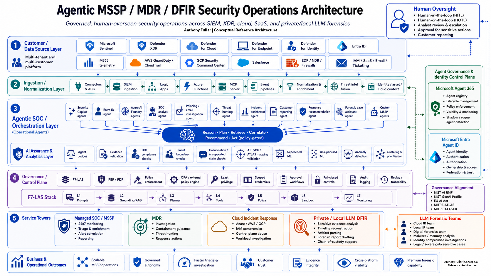
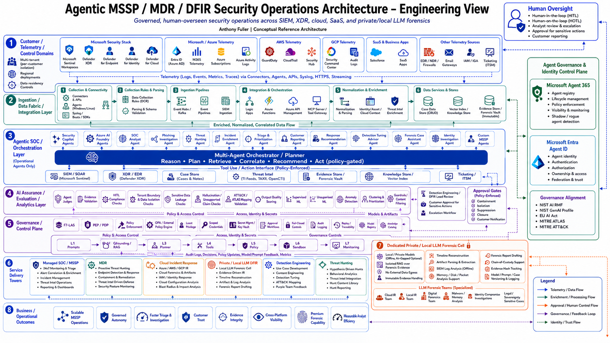
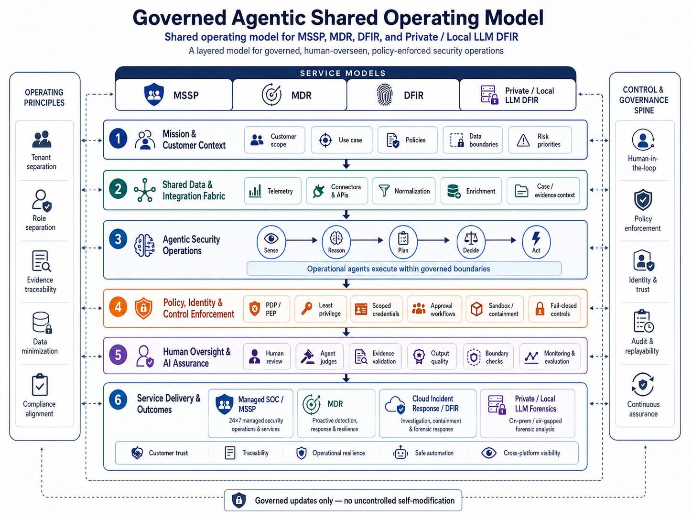
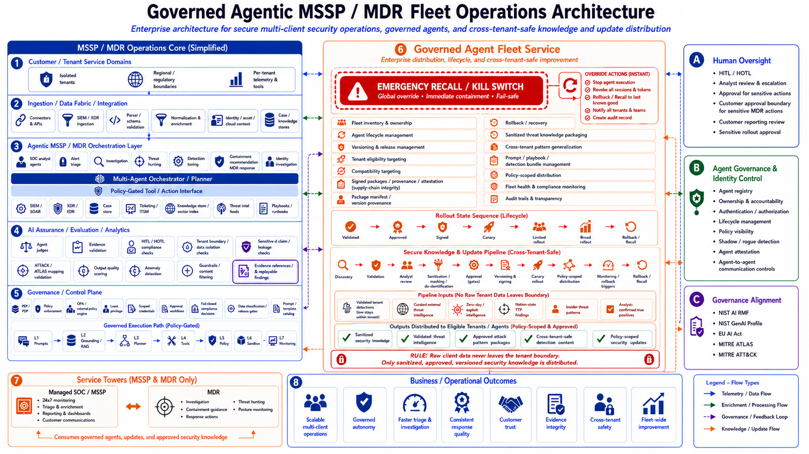

# Governed Agentic Security Operations Architecture

> **Disclaimer:** This is an independent personal conceptual reference architecture. It is not affiliated with, sponsored by, endorsed by, reviewed by, approved by, or maintained by Microsoft or any employer of the author. See [`DISCLAIMER.md`](DISCLAIMER.md).

## Overview

This repository provides a reference architecture, adoption kit, and offline conformance tooling for governed agentic security operations.

It is designed for MSSP, MDR, SOC, cloud incident response, and private/local LLM-assisted DFIR use cases where agent-assisted workflows must remain scoped, policy-mediated, human-accountable, tenant-safe, evidence-aware, and auditable.

The repository includes architecture views, governance patterns, service operating models, threat models, a normative control catalog, implementation profiles, reusable templates, schema-governed examples, and deterministic validation tooling. It supports architecture review, service design, governance planning, artifact validation, and conformance testing without operating a real security platform.

## Core Principle

Agentic systems may assist security operations, but they do not authorize themselves.

Agents may retrieve, reason, summarize, correlate, classify, draft, recommend, and prepare approval packages. They must not independently grant themselves authority, bypass policy, execute privileged actions, cross tenant or case boundaries, modify evidence, approve customer-facing releases, or replace accountable human decision makers.

## Repository Scope

This repository is an architecture, governance, and adoption library with limited offline validation code. It is not a production deployment package or security operations product.

It does not provide:

- a SOC automation product;
- an autonomous response platform;
- a production control plane;
- a SIEM or SOAR deployment package;
- a legally sufficient DFIR evidence system;
- a customer-ready managed security service;
- production control-plane code, external tool execution, infrastructure automation, deployment templates, production policy enforcement, or vendor credentials.

The included `gaso` tooling validates repository-defined artifacts and reconstructs synthetic audit records. It does not invoke agents, models, SIEM, SOAR, EDR, identity, cloud, case-management, or forensic systems. Real enforcement remains an external implementation responsibility.

Product names, where referenced in architecture assumptions or examples, are conceptual placement references unless explicitly stated otherwise. This repository does not claim that any specific vendor product natively provides all controls described here.

## Intended Audience

This repository is intended for:

- MSSP and MDR architects designing governed agentic security operations;
- SOC transformation leaders evaluating agent-assisted workflows;
- cloud incident response teams designing controlled response patterns;
- DFIR teams evaluating private/local LLM-assisted forensic workflows;
- AI security architects defining assurance, policy, and governance boundaries;
- governance, risk, compliance, and customer-assurance stakeholders reviewing control models;
- engineering teams building separate implementations that need architecture and governance alignment.

## Governance Invariants

The following boundaries are treated as architecture invariants:

- Agent outputs do not authorize execution.
- Agent judges are assurance components only; they do not grant approval.
- The Policy Decision Point decides whether an action is allowed, denied, escalated, or failed closed.
- The Policy Enforcement Point enforces the decision before any tool, tenant, evidence store, customer environment, or production system is affected.
- Human review is not the same as formal approval.
- Customer approval is separate from internal MSSP, MDR, SOC, or DFIR review.
- Tool registration and tool availability are not authorization.
- Evidence-derived summaries are not original evidence.
- Private/local LLM execution is not proof of correctness, evidentiary validity, or forensic completeness.
- Customer-facing release requires proper review and approval paths.
- RAG, memory, retrieval, vector search, customer context, case memory, shared context, evidence retrieval, and retrieved context must preserve tenant, customer, case, evidence, retention, and data-sovereignty boundaries.
- Missing, ambiguous, stale, unauthorized, cross-tenant, cross-customer, cross-case, retention-inconsistent, or unauditable context must fail closed where governed workflow behavior depends on it.

## How to Use This Repository

Use the repository by the architectural question you are working through.

| Question | Start Here |
|---|---|
| What is the overall architecture? | [`architecture/`](architecture/readme.md) |
| What reusable design patterns are available? | [`patterns/`](patterns/readme.md) |
| Which normative controls apply? | [`controls/`](controls/README.md) |
| Which service profile should I use? | [`profiles/`](profiles/README.md) |
| What do example records and artifacts look like? | [`examples/`](examples/readme.md) |
| How do MSSP, MDR, cloud IR, and DFIR service boundaries work? | [`service-models/`](service-models/readme.md) |
| What threats and failure modes should be evaluated? | [`threat-model/`](threat-model/readme.md) |
| How are agents governed across lifecycle, access, monitoring, and rollback? | [`agent-governance/`](agent-governance/readme.md) |
| How are policy decisions and enforcement boundaries modeled? | [`policy-enforcement/`](policy-enforcement/readme.md) |
| What reusable records and templates are available? | [`templates/`](templates/readme.md) |
| How do I adopt and tailor a profile? | [`ADOPTION-GUIDE.md`](ADOPTION-GUIDE.md) |
| What is validated here versus externally enforced? | [`TRACEABILITY.md`](TRACEABILITY.md) |

## Quick Start

New readers can use the role-based quick-start guides to navigate the repository by objective:

| Role or Objective | Start Here | Goal |
|---|---|---|
| MSSP / MDR architect | [`quick-start/for-mssp-mdr.md`](quick-start/for-mssp-mdr.md) | Review tenant-safe, policy-mediated agentic security operations. |
| DFIR practitioner | [`quick-start/for-dfir.md`](quick-start/for-dfir.md) | Review local/private LLM-assisted DFIR boundaries, evidence handling, and audit replay. |
| Adoption-kit builder | [`quick-start/for-poc-builders.md`](quick-start/for-poc-builders.md) | Validate governance artifacts and conformance locally without operating real systems. |

### Local Validation

The `gaso` CLI requires Python 3.11 or later and operates on local synthetic artifacts only.

```bash
python -m venv .venv
. .venv/bin/activate
python -m pip install -e ".[dev]"

gaso validate controls/control-catalog.yaml profiles/mssp.yaml
gaso verify-tenant-scope \
  templates/governed-action-request.yaml \
  templates/human-approval-record.yaml \
  templates/customer-approval-record.yaml
gaso evaluate-policy templates/governed-action-request.yaml \
  --policy policies/endpoint-response-policy.yaml \
  --approvals templates/human-approval-record.yaml templates/customer-approval-record.yaml
gaso verify-evidence-manifest templates/evidence-manifest.yaml \
  --lineage templates/derived-artifact-lineage.yaml
gaso verify-audit-chain tests/fixtures/audit-valid.jsonl
gaso replay tests/fixtures/audit-valid.jsonl
pytest
```

`ALLOW` means only that the synthetic request satisfied the selected reference policy. The CLI never invokes the requested action.

## Scenario Walkthroughs

Scenario walkthroughs show how the architecture applies to concrete governed security operations workflows.

| Walkthrough | Focus |
|---|---|
| [`walkthroughs/mssp-endpoint-isolation.md`](walkthroughs/mssp-endpoint-isolation.md) | Agent recommendation, evidence support, policy decision, human approval, scoped tool execution, and audit replay. |
| [`walkthroughs/mdr-cloud-iam-compromise.md`](walkthroughs/mdr-cloud-iam-compromise.md) | Cloud identity containment recommendation with exact approval and tool boundaries. |
| [`walkthroughs/dfir-local-llm-timeline.md`](walkthroughs/dfir-local-llm-timeline.md) | Local-model timeline lineage, review, and replay without evidentiary claims. |

## Architecture Views

### Executive View

High-level conceptual view of governed agentic security operations across MSSP, MDR, SOC, cloud incident response, and private/local LLM-assisted DFIR workflows.



[`architecture/executive-view.md`](architecture/executive-view.md)

### Engineering View

Engineering-oriented view of the control plane, orchestration layer, AI assurance layer, tool access, policy enforcement, tenant isolation, and auditability model.



[`architecture/engineering-view.md`](architecture/engineering-view.md)

### Shared Operating Model

Layered operating model showing how customer and data sources, ingestion, context assembly, agent runtime, policy enforcement, oversight, tool access, auditability, and agent governance fit together.



[`architecture/layered-architecture.md`](architecture/layered-architecture.md)

### Runtime Control Loop

Control-loop view for policy-gated agentic execution, human oversight, PEP-enforced tool access, validation, monitoring, and continuous assurance.


[`architecture/control-loop.md`](architecture/control-loop.md)

### Agentic Fleet Operations

Cross-cutting capability view for governing agent lifecycle, fleet updates, signed releases, tenant eligibility, policy-scoped distribution, staged rollout, emergency recall, rollback, and fleet-wide auditability.



Use this view with the agent governance materials for fleet lifecycle, versioning, rollback, recall, tenant eligibility, and change-control design.

## Repository Map

The root README provides the high-level map. See [`REPO-STRUCTURE.md`](REPO-STRUCTURE.md) for the detailed repository layout.

| Area | Start Here | Role |
|---|---|---|
| `quick-start/` | [`quick-start/README.md`](quick-start/README.md) | Role-based navigation paths for MSSP/MDR, DFIR, and PoC-builder readers. |
| `walkthroughs/` | [`walkthroughs/README.md`](walkthroughs/README.md) | Concrete scenario walkthroughs that connect recommendations, policy decisions, approval, execution, and audit replay. |
| `architecture/` | [`architecture/readme.md`](architecture/readme.md) | Architecture views, principles, assumptions, control loop, and diagrams. |
| `patterns/` | [`patterns/readme.md`](patterns/readme.md) | Reusable architecture patterns for governed agentic security operations. |
| `examples/` | [`examples/readme.md`](examples/readme.md) | Scenario artifacts showing requests, approvals, decisions, judge outputs, evidence, timelines, review records, and audit events. |
| `service-models/` | [`service-models/readme.md`](service-models/readme.md) | Operating models for MSSP, MDR, cloud incident response, private/local LLM-assisted DFIR, and fleet operations. |
| `threat-model/` | [`threat-model/readme.md`](threat-model/readme.md) | Threat scenarios and risk models for agentic security operations. |
| `agent-governance/` | [`agent-governance/readme.md`](agent-governance/readme.md) | Agent identity, lifecycle, access scope, communication, monitoring, change control, fleet governance, and rollback. |
| `policy-enforcement/` | [`policy-enforcement/readme.md`](policy-enforcement/readme.md) | Policy decision and enforcement model, risk classification, approval policy, and fail-closed behavior. |
| `human-oversight/` | [`human-oversight/readme.md`](human-oversight/readme.md) | Human review, approval boundaries, customer approval, escalation, and review records. |
| `tenant-isolation/` | [`tenant-isolation/readme.md`](tenant-isolation/readme.md) | Tenant boundary model, scope validation, cross-tenant failure modes, and audit requirements. |
| `tool-access/` | [`tool-access/readme.md`](tool-access/readme.md) | Tool registration, restricted tool patterns, scoped execution, and tool audit. |
| `data-ingestion/` | [`data-ingestion/readme.md`](data-ingestion/readme.md) | Source metadata, normalization, enrichment, failure handling, and ingestion replay. |
| `evidence-traceability/` | [`evidence-traceability/readme.md`](evidence-traceability/readme.md) | Evidence references, finding support, DFIR evidence handling, and evidence audit replay. |
| `local-llm-dfir/` | [`local-llm-dfir/readme.md`](local-llm-dfir/readme.md) | Local/private LLM DFIR boundaries, evidence handling, review, and audit replay. |
| `audit-replay/` | [`audit-replay/readme.md`](audit-replay/readme.md) | Audit event model, replayability, correlation, failure audit, and immutable audit guidance. |
| `templates/` | [`templates/readme.md`](templates/readme.md) | Standard records and reusable documentation templates. |
| `controls/` | [`controls/README.md`](controls/README.md) | Normative machine-readable control catalog. |
| `profiles/` | [`profiles/README.md`](profiles/README.md) | MSSP, MDR, and DFIR control selections and adoption requirements. |
| `schemas/` | [`schemas/index.json`](schemas/index.json) | JSON Schema registry for repository artifacts. |
| `policies/` | [`policies/endpoint-response-policy.yaml`](policies/endpoint-response-policy.yaml) | Deterministic, synthetic reference policy fixtures. |
| `src/gaso/` | [`src/gaso/cli.py`](src/gaso/cli.py) | Offline validation, policy, scope, evidence, audit, and replay CLI. |
| `tests/` | [`tests/`](tests/) | Positive and negative conformance tests and synthetic fixtures. |
| `governance-library/ai-assurance/` | [`governance-library/ai-assurance/readme.md`](governance-library/ai-assurance/readme.md) | Agent judge contracts, output quality checks, unsupported-claim checks, tenant-boundary checks, and limitations. |

## Schema-Governed Reference Artifacts

The JSON files under `examples/` are synthetic reference artifacts. They show representative requests, judge outputs, approvals, policy decisions, evidence manifests, timeline outputs, review records, and audit events.

The repository validates their declared structure and selected governance invariants. Validation does not make them production payloads and does not prove runtime enforcement, factual correctness, evidentiary validity, or operational safety.

## Executable Conformance Tooling

The deterministic `gaso` CLI validates local artifacts, checks tenant and case scope, evaluates synthetic reference policies, verifies evidence manifests and audit chains, and reconstructs recorded timelines.

It never executes the governed action. Organizations remain responsible for implementing and verifying production identity, authorization, policy enforcement, approval, tenant isolation, tool mediation, logging, evidence preservation, and security controls.

## Public Repository Positioning

This repository is intended to be useful as a public architecture and adoption reference while avoiding claims that imply product readiness, official guidance, vendor endorsement, or production deployment status.

The emphasis is on architecture clarity, governance boundaries, tenant isolation, evidence traceability, human accountability, and auditability.

## Final Repository Principle

Architecture, patterns, examples, service models, threat models, templates, governance controls, and implementation-specific artifacts should remain separated.

> Agentic assistance can accelerate investigation, response, and reporting only when it is surrounded by identity, policy, approval, audit, tenant isolation, evidence controls, and human accountability.
