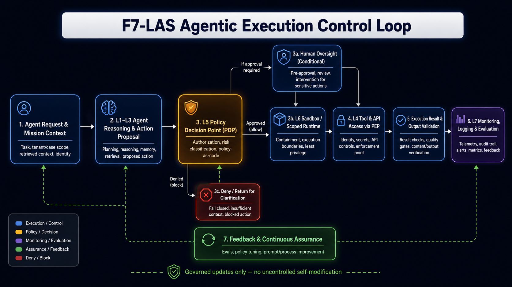

# F7-LAS Agentic Execution Control Loop

## Purpose

The F7-LAS Agentic Execution Control Loop defines the runtime governance pattern used across the **Agentic MSSP / MDR / DFIR Security Operations Architecture**. It shows how agentic actions are proposed, policy-evaluated, human-reviewed when required, executed within scoped boundaries, validated, monitored, and fed back into continuous assurance.

Its purpose is to ensure that agentic systems do not act on implicit trust, but operate through explicit mission context, policy decisioning, enforcement points, human oversight, auditability, and fail-closed controls.

---

## Control Loop Diagram

[Open the full-resolution F7-LAS execution control-loop diagram](diagrams/control-Loop.png)

The diagram is a conceptual runtime-governance view. It illustrates how agent requests and proposed actions move through policy evaluation, conditional human oversight, scoped execution, tool enforcement, output validation, monitoring, and governed feedback. It does not represent a deployed production environment or claim that every depicted capability is implemented by this repository.

---

## Where It Applies

This file defines the runtime action-control loop; fleet package rollout, rollback, recall, and cross-tenant intelligence distribution are handled by the fleet control-loop and tenant-isolation documents.

This control loop supports governed security operations across **MSSP**, **MDR**, **SOC / Incident Response**, **DFIR**, and **Private / Local LLM-assisted DFIR** where applicable.

The loop can be used anywhere an agent, automation, workflow, or AI-assisted security process may propose or execute an action that affects tools, data, evidence, tenants, cases, customers, or operational outcomes.

Primary use cases include:

- **MSSP operations** — triage, enrichment, alert correlation, customer reporting, workflow recommendations, and governed response support.
- **MDR operations** — investigation support, containment recommendations, detection tuning, escalation, and response workflows.
- **SOC / Incident Response** — policy-gated investigation, escalation, approval routing, tool access, and evidence-backed action.
- **DFIR** — case handling, evidence validation, chain-of-custody support, forensic workflow assistance, and report preparation.
- **Private / Local LLM-assisted DFIR** — applicable when local, isolated, air-gapped, or customer-controlled AI assistance is used for forensic analysis, evidence review, summarization, reporting, or workflow support.

Not every workflow requires every branch in the loop. For example, read-only enrichment may not require human approval, while destructive actions, customer-impacting actions, privileged tool use, or evidence-sensitive decisions should trigger stricter policy and review requirements.

## Control Loop Flow

1. **Agent Request & Mission Context**  
   Captures the task, tenant or case scope, retrieved context, identity, authority, and operational purpose.

2. **L1–L3 Agent Reasoning & Action Proposal**  
   The agent reasons over context, retrieves supporting information, plans the next step, and proposes an action. The proposed action should remain non-executing until policy and enforcement controls approve it.

3. **L5 Policy Decision Point (PDP)**  
   A policy decision is made before execution. The policy engine evaluates authorization, risk, tenant/case scope, tool permissions, approval requirements, data boundaries, and policy-as-code rules.

4. **Conditional Human Oversight**  
   Human review is required for sensitive, destructive, customer-impacting, privileged, evidence-related, or policy-exception actions.

5. **L6 Sandbox / Scoped Runtime**  
   Approved actions execute only within a scoped runtime using containment, bounded permissions, approved tools, and least privilege.

6. **L4 Tool & API Access via PEP**  
   Tool and API access is enforced through a Policy Enforcement Point. The PEP applies identity, secrets, API controls, runtime constraints, and execution boundaries.

7. **Execution Result & Output Validation**  
   Results are checked for correctness, quality, policy alignment, evidence support, tenant/case scope, and customer-impact risk before being used, escalated, or released.

8. **L7 Monitoring, Logging & Evaluation**  
   Telemetry, audit trails, alerts, metrics, decisions, tool calls, approvals, denials, and execution outcomes are logged and evaluated.

9. **Feedback & Continuous Assurance**  
   Monitoring and evaluation results feed back into prompts, policies, test cases, process improvements, assurance controls, and operating procedures through governed change control.

## Fleet and Propagation Boundary

If a runtime workflow produces a proposed prompt update, detection update, playbook change, report-template change, sanitized intelligence item, or agent package change, that output must leave the runtime execution loop and enter governed fleet change control.

Runtime approval to use tenant-scoped context does not authorize cross-tenant reuse, fleet distribution, shared-memory writes, or package rollout.

Cross-tenant propagation requires sanitization, human review, policy approval, tenant eligibility checks, monitoring, audit, and rollback or recall support.

## Required Decision Outcomes

The loop should support explicit decision paths:

- **Allow** — proceed to scoped execution.
- **Deny** — block the action and fail closed.
- **Require Approval** — route to human oversight before execution.
- **Return for Clarification** — request more context when the mission, authority, data scope, evidence basis, or policy basis is insufficient.

## Key Control Principles

- **Policy before execution**
- **PEP/PDP separation**
- **Least privilege tool access**
- **Scoped credentials**
- **Tenant, customer, and case boundary enforcement**
- **Human oversight for sensitive actions**
- **Fail-closed behavior**
- **Evidence-backed outputs**
- **Full audit and replayability**
- **Continuous assurance without uncontrolled self-modification**

## Private / Local LLM-assisted DFIR Applicability

The loop can apply to **Private / Local LLM-assisted DFIR**, but only where AI assistance, agentic workflows, local model execution, or tool-assisted forensic workflows are part of the operating model.

For private/local DFIR, the model or agent may run offline, locally, or in an isolated forensic environment. The loop should still preserve the governance boundaries that matter for forensic integrity:

- case and evidence scope must be explicit;
- evidence provenance and chain of custody must be preserved;
- tool use must be controlled and logged;
- generated findings must be evidence-supported;
- sensitive actions require human review;
- outputs must not alter evidence or create unsupported forensic conclusions;
- prompts, model configuration, policies, and workflows must follow governed change control.

If a DFIR workflow is purely manual and does not use AI assistance, agentic execution, or automated tool action, this loop should not be forced onto that workflow. In that case, the relevant controls are evidence integrity, chain of custody, human review, auditability, and reporting quality rather than agentic execution control.

## Summary

This loop provides a reusable control pattern for agentic security operations. It ensures that agent actions are not trusted by default, but are governed through mission context, policy decisioning, human oversight, scoped execution, tool enforcement, validation, monitoring, and continuous assurance.

The core operating principle is:

> Agentic systems may assist MSSP, MDR, SOC / Incident Response, DFIR, and Private / Local LLM-assisted DFIR operations, but execution must remain policy-gated, auditable, scoped, and human-overseen where risk requires it.
