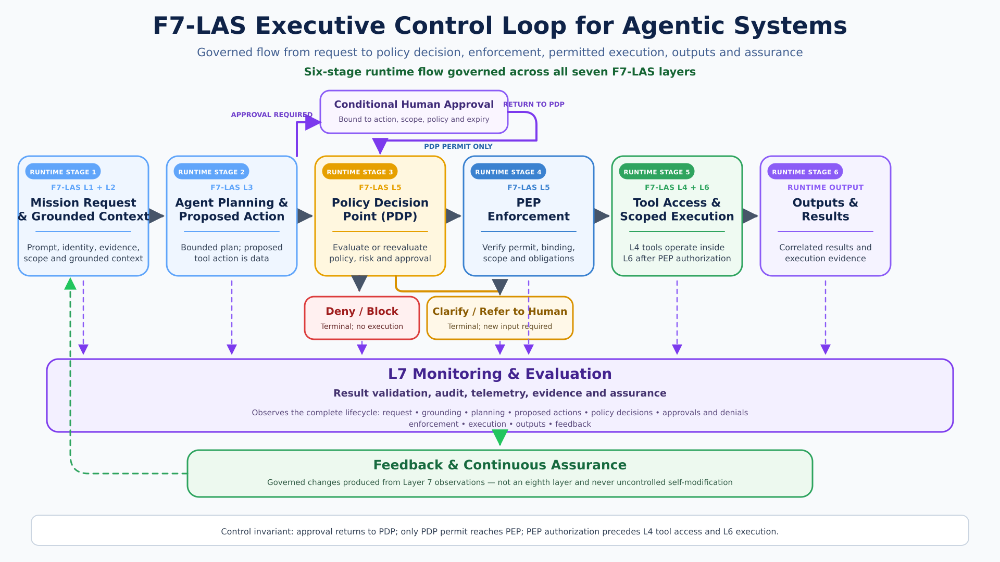

# F7-LAS Agentic Execution Control Loop

## Purpose

The F7-LAS Agentic Execution Control Loop defines the runtime governance pattern used across the **Agentic MSSP / MDR / DFIR Security Operations Architecture**. It presents a six-stage runtime flow while preserving all seven F7-LAS architectural responsibilities. It shows how agentic actions are proposed, policy-evaluated, human-reviewed when required, executed within scoped boundaries, observed, and fed back into continuous assurance.

Its purpose is to ensure that agentic systems do not act on implicit trust, but operate through explicit mission context, policy decisioning, enforcement points, human oversight, auditability, and fail-closed controls.

---

## Executive Control Loop Diagram

[Open the full-resolution F7-LAS executive control-loop diagram](diagrams/f7-las-executive-control-loop-agentic-systems.png)

The numbered elements are runtime stages, not F7-LAS layer numbers. The executive diagram summarizes a **six-stage runtime flow governed across all seven F7-LAS layers**. L1 Prompt and L2 Grounding remain distinct architectural responsibilities even though they are compressed into the first runtime stage.

## Agentic Execution Control Loop Diagram

[Open the full-resolution F7-LAS execution control-loop diagram](diagrams/control-Loop.png)

The technical diagram shows the corresponding layer responsibilities and enforcement sequence. Its six displayed runtime stages are workflow compression; they do not merge or redefine the seven architectural layers.

Both diagrams are conceptual runtime-governance views. They do not represent a deployed production environment, claim that every depicted capability is implemented by this repository, or establish production enforcement. The repository CLI performs offline conformance checks and does not execute external actions.

### Canonical F7-LAS semantics

- **L7 Monitoring & Evaluation** performs result validation, audit, telemetry, evidence, and assurance.
- Layer 7 observes the complete lifecycle: request, grounding, planning, proposed actions, policy decisions, approvals, denials, enforcement, execution, outputs, and feedback.
- Runtime stages and terminal outcomes flow into Layer 7 observation.
- **Feedback & Continuous Assurance** is governed feedback produced from Layer 7 observations. It is not an eighth layer and does not permit uncontrolled self-modification.
- Conditional human approval returns to the PDP for reevaluation and never authorizes direct execution.
- Only a PDP permit reaches the PEP. PEP authorization precedes Layer 4 tool access and Layer 6 execution.
- **Deny / Block** and **Clarify / Refer to Human** are distinct terminal outcomes.

| Diagram asset | Dimensions | SHA-256 |
|---|---:|---|
| `diagrams/f7-las-executive-control-loop-agentic-systems.png` | 1920 × 1080 | `0e250eff8f021973608a77df78f01b276ed8c1147f25d24e493f9d96bc8b38ff` |
| `diagrams/control-Loop.png` | 1920 × 1080 | `777f4a5de48dcc98ea0332358c0d9272ca4ca13d12889143a3e42464d4e6187d` |

---

## Where It Applies

This file defines the runtime action-control loop; fleet package rollout, rollback, recall, and cross-tenant intelligence distribution are handled by the fleet control-loop and tenant-isolation documents.

This control loop supports governed security operations across **MSSP**, **MDR**, **SOC / Incident Response**, **DFIR**, and **Private / Local LLM-assisted DFIR** where applicable.

The loop can be used anywhere an agent, automation, workflow, or AI-assisted security process may propose or execute an action that affects tools, data, evidence, tenants, cases, customers, or operational outcomes.

Primary use cases include:

- **MSSP operations** — triage, enrichment, alert correlation, customer reporting, workflow recommendations, and governed response support.
- **MDR operations** — investigation support, containment recommendations, detection tuning, escalation, and response workflows.
- **SOC / Incident Response** — policy-gated investigation, escalation, approval routing, tool access, and evidence-backed action.
- **DFIR** — case handling, evidence validation, chain-of-custody support, forensic workflow assistance, and report preparation.
- **Private / Local LLM-assisted DFIR** — applicable when local, isolated, air-gapped, or customer-controlled AI assistance is used for forensic analysis, evidence review, summarization, reporting, or workflow support.

Not every workflow requires every branch in the loop. For example, read-only enrichment may not require human approval, while destructive actions, customer-impacting actions, privileged tool use, or evidence-sensitive decisions should trigger stricter policy and review requirements.

## Control Loop Flow

The runtime sequence is compressed into six stages for readability. The F7-LAS layers remain distinct responsibility domains and do not have to execute in simple numeric order.

1. **Runtime Stage 1 — L1 Prompt + L2 Grounding: Mission Request & Grounded Context**
   L1 establishes the governed request, identity, purpose, scope, and constraints. L2 supplies authorized evidence and grounded context. They remain distinct responsibilities within the compressed stage.

2. **Runtime Stage 2 — L3 Agent Planning & Proposed Action**
   Agent Planning creates a bounded plan and proposed Layer 4 tool action. The proposed action remains data, not authority, and must not execute until policy and enforcement controls permit it.

3. **Runtime Stage 3 — L5 Policy Decision Point (PDP)**
   The PDP evaluates authorization, risk, tenant/case scope, tool permissions, approval requirements, data boundaries, and policy-as-code rules. If approval is required, the approval is bound to the proposed action, scope, policy, and expiry and returns to the PDP for reevaluation. Deny / Block and Clarify / Refer to Human terminate the current path without execution.

4. **Runtime Stage 4 — L5 Policy Enforcement Point (PEP)**
   Only a PDP permit reaches the PEP. The PEP verifies the decision, binding, scope, and obligations before authorizing access.

5. **Runtime Stage 5 — L4 Tool Access + L6 Scoped Execution**
   Layer 4 tool access and the executor operate inside the approved Layer 6 boundary only after PEP authorization, using containment, bounded permissions, approved tools, and least privilege.

6. **Runtime Stage 6 — Outputs & Results**
   The runtime emits correlated results and execution evidence. These outputs do not bypass validation, release, evidence, or customer-impact controls.

**L7 Monitoring & Evaluation** observes every runtime stage and terminal outcome. It receives the decisions, telemetry, evidence, and outcomes needed for result validation, audit, evaluation, and assurance.

**Feedback & Continuous Assurance** uses Layer 7 observations to inform governed prompt, policy, test, process, assurance-control, and operating-procedure changes. Those changes follow change control; they are not direct runtime self-modification.

## Fleet and Propagation Boundary

If a runtime workflow produces a proposed prompt update, detection update, playbook change, report-template change, sanitized intelligence item, or agent package change, that output must leave the runtime execution loop and enter governed fleet change control.

Runtime approval to use tenant-scoped context does not authorize cross-tenant reuse, fleet distribution, shared-memory writes, or package rollout.

Cross-tenant propagation requires sanitization, human review, policy approval, tenant eligibility checks, monitoring, audit, and rollback or recall support.

## Required Decision Outcomes

The loop should support explicit decision paths:

- **Permit / Allow** — send the bound decision to the PEP, then proceed to scoped execution only after successful enforcement.
- **Deny / Block** — terminate the path without PEP authorization or execution.
- **Require Approval** — route to human approval, then return the bound approval to the PDP for reevaluation.
- **Clarify / Refer to Human** — terminate the current path and require new input when the mission, authority, data scope, evidence basis, or policy basis is insufficient.

## Key Control Principles

- **Policy before execution**
- **PEP/PDP separation**
- **Least privilege tool access**
- **Scoped credentials**
- **Tenant, customer, and case boundary enforcement**
- **Human oversight for sensitive actions**
- **Fail-closed behavior**
- **Evidence-backed outputs**
- **Full audit and replayability**
- **Continuous assurance without uncontrolled self-modification**

## Private / Local LLM-assisted DFIR Applicability

The loop can apply to **Private / Local LLM-assisted DFIR**, but only where AI assistance, agentic workflows, local model execution, or tool-assisted forensic workflows are part of the operating model.

For private/local DFIR, the model or agent may run offline, locally, or in an isolated forensic environment. The loop should still preserve the governance boundaries that matter for forensic integrity:

- case and evidence scope must be explicit;
- evidence provenance and chain of custody must be preserved;
- tool use must be controlled and logged;
- generated findings must be evidence-supported;
- sensitive actions require human review;
- outputs must not alter evidence or create unsupported forensic conclusions;
- prompts, model configuration, policies, and workflows must follow governed change control.

If a DFIR workflow is purely manual and does not use AI assistance, agentic execution, or automated tool action, this loop should not be forced onto that workflow. In that case, the relevant controls are evidence integrity, chain of custody, human review, auditability, and reporting quality rather than agentic execution control.

## Summary

This loop provides a reusable control pattern for agentic security operations. It ensures that agent actions are not trusted by default, but are governed through mission context, policy decisioning, human oversight, scoped execution, tool enforcement, validation, monitoring, and continuous assurance.

The core operating principle is:

> Agentic systems may assist MSSP, MDR, SOC / Incident Response, DFIR, and Private / Local LLM-assisted DFIR operations, but execution must remain policy-gated, auditable, scoped, and human-overseen where risk requires it.
